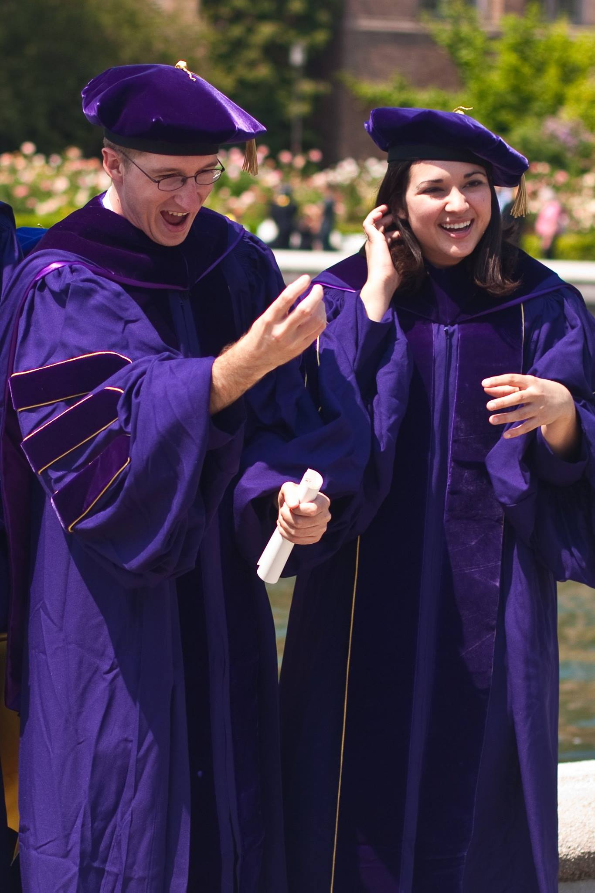

I am an applied mathematician working in a number of problems connected to nonlinear wave propagation, fluid dynamics, and data science. I completed my PhD in applied mathematics at the University of Washington in 2009 under <a href="https://depts.washington.edu/bdecon/bernard/"> Bernard Deconinck </a>. Afterwards, I performed postdoctoral work with <a href="https://sites.google.com/site/ablowitz/"> Mark Ablowitz </a> at CU Boulder. I joined SDSU in 2013, where I have since published a range of papers in fluids and data science, mentored quite a few students through their theses, developed MATH 340, which is a thorough introduction to using Python in mathematics, and run a semester of the <a href="https://www.maa.org/programs-and-communities/professional-development/pic-math">PIC Math</a> program, among other things.  

<a href="https://github.com/cwcurtis/cwcurtis.github.io/blob/main/cv_2019_long.pdf" target="_blank"> Curriculum Vitae </a>
 

